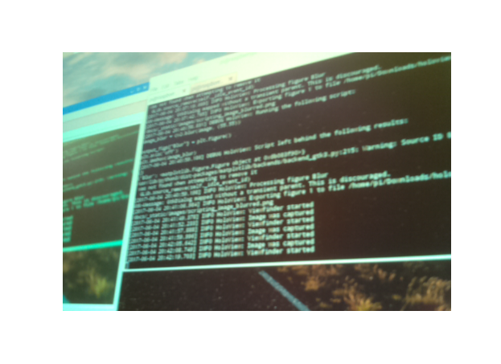
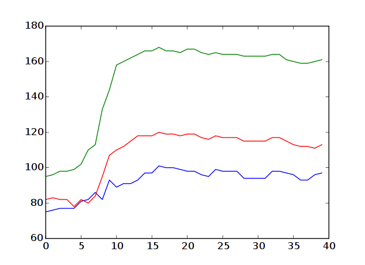

Scripting Cookbook
==================

Convert image to grayscale
--------------------------
For many calculations you won't need the color information. To convert a image
to grayscale, you can use the OpenCV library, which has color-conversion methods
built in:

.. code-block:: python

    image_gray = cv2.cvtColor(image, cv2.COLOR_BGR2GRAY)

    output_figs["Image"] = plt.figure()
    plt.imshow(image)
    output_figs["Gray"] = plt.figure()
    plt.imshow(image_gray)

Smooth the image
-----------------
If the captured image contains too much detail you'll have to smooth it out.
In image processing, we usually use a *Gaussian Blur* for this.

.. code-block:: python

    image_blur = cv2.blur(image, (50, 50))

    output_figs["Blur"] = plt.figure()
    plt.axis('off')
    plt.imshow(image_blur)

Notice that the second parameter of the `cv2.blur` function indicates the size
of the filter. Because the blur simply averages the pixel values, the bigger the
size the greater the range of influence of a certain pixel, thus more blurry the
outcome.

The left image is the original captured image, right of it is the blurred version
with a filter size of 55 by 55.

Plot some curve
---------------
Suppose that you have some data extracted from the image as an array. With
matplotlib, you can easily turn that into a graph. In this example, we'll extract
the first 40 pixels of the top row and display their value as a curve.

.. code-block:: python

    some_data = image[0][0:40]
    output_figs["Some Graph"] = plt.figure()
    plt.plot(some_data)

It results in this nice line plot below. As you can see we have three curves,
because there are multiple color values per pixel (R/G/B). They have also been
colored accordingly.

